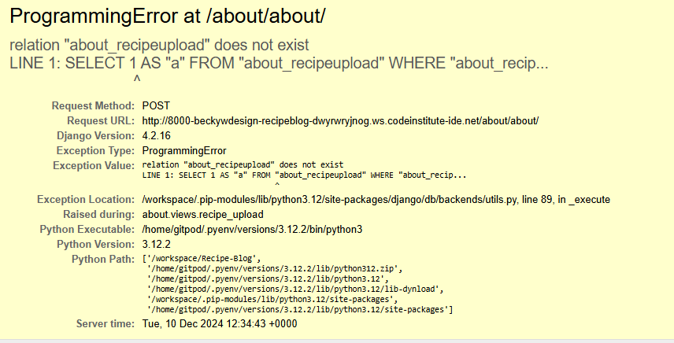

<h1 style="text-align: center;">Welcome to The Recipe Book</h1>

The ultimate hub for food lovers and home cooks! Discover a world of delicious possibilities as you swap recipes with fellow cooking enthusiasts, rate and discuss your favourite dishes, and create a personalised collection of recipes you love. Whether you're mastering the art of cooking or just exploring new flavours, The Recipe Book brings a vibrant community of foodies right to your kitchen. Let’s cook, share, and savour together.

# Table of Contents

1. [Problem Statement](#problem-statement)
2. [Purpose](#purpose)
3. [Target Audience](#target-audience)
4. [Features](#features)
5. [Additional Features](#additional-features)
6. [Database Structure](#database-structure)
7. [User Experience / Wireframes](#userexperience-wireframes)
8. [Agile Methodology](#agile-methodology)
9. [User Stories](#user-stories)
10. [Testing](#testing)
11. [Deployment](#deployment)
12. [Citation of Sources](#citation-of-sources)
13. [Known Bugs](#known-bugs)
15. [Credits](#credits)

## Problem Statement
The most common question asked in my household is, "What's for dinner?" 
As a single working mum, this question fills me with dread and takes up more time than I feel I have to decide, shopping for ingredients and then preparing the meal. Then throw in a curve ball, a friend who has a gluten intolerance or allergy... pure panic! Which Is why I developed this recipe blog. A place to share and find recipes to help reduce the mealtime dread. 

## Purpose

Households are becoming busier and with the current climate the importance of meal planning to help tighter budgets is even greater. The purpose of this site is to help users to meal plan, budget and share great recipes.

## Target Audience

All those who cook our of enjoyment or necessity

## Features

A login/Logout feature.
Comment section for users to add comments.
A page to upload and share recipes.
Recipes with ingretients timings and tags to any alergens.
Picture upload feature.
Links to social media to share recipes users have tried.

## Additional Features

A search bar to easily find a recipe
A filter to help reduce the number of recipes avlible/ remove those recipes that have certain ingrient in them.
A space for individuals to keep a recipe folder of there favorite recipes.

## Database Structure

## User Experience / Wireframes

<h2 style="text-align: center;">Mood Board that inspired the website.</h2>

<h2 style="text-align: center;">Wire Frames</h2>

  
 

<h2 style="text-align: center;">Screen shots</h2>

## Agile Methodology

<h3>Kanban Board</h3>

<h3>Project Board</h3>
The project board can be found <a href="https://miro.com/app/board/uXjVLBAyMvE=/>">here</a>

## User Stories

| User Story | Feature |
| ----------| -------- |
| I am a user I want to be able to see the recipes clearly and be able to identify the ingredients needed | Recipe Cards with Ingredients |  
| I am a user I want to be have clear space to see and sort recipes| A space for users to store a collection of recipes |
|I am a user I want to be able to share my own recipes for others to use| Ability to upload users own recipes|
| As a user I want to be able to comment on recipes because I want to give feedback to others on how a recipe turned out. | Comment section under the recipe |
| As a user I want to be able to rate recipes and see which are the best to try myself | A star rating feature for each recipe |
|As an admin and I want to be able to monitor who is making comments on the recipes | Login feature with username |
| As a user I want to connect to my social media to share the recipes I have created| Social Media linked to the website |
| I am a user and I want to be able to log in so I can comment, rate and store my favourite recipes| Sign up feature |
| As a user I want to be able to sort recipes by ingredients because I can exclude any that may have allergens or ingredients I dislike.| Filter function for recipes|
| As a user I wish to upload photos of food I have created because I want feedback from others.| Photo uploading feature|
| As a user I want to be able to search for recipes of ingredients easily | Search function |

<h3>MoSCoW score features</h3>
Must Haves
<ul>
<li>Recipe Cards with Ingredients</li>
<li>A star rating feature for each recipe</li>
<li>login feature with username</li>
<li>Sign up feature</li>
<lil>Comment section under the recipe</li>
<li>Upload users own recipes</li>
</ul> 
Should Haves
<ul>
<li>Photo uploading</li>
<li>Social Media linked to the website</li>
</ul>
Could Haves
<ul>
<li>A space for users to store a collection of recipes</li>
<li>Search function</li>
</ul>
Won't Haves 
<ul>
<li>The ability to select ingredients and add to a shopping list.</li>
<li>Sort recipes and exclude those with allergens </li>
</ul>

## Testing

## Deployment

## Citation of Sources

| Description | Source |
| ----------- | ------ |
| Recipe content | Chat GPT |
| Stock Image of Cupcake  | https://www.pexels.com/photo/person-holding-cupcake-with-white-icing-4099127/ | 
| Stock Image of spices | https://www.pexels.com/photo/assorted-cooking-spices-2802527/ |
| Stock Image of bowl | https://www.pexels.com/photo/person-pouring-salt-in-bowl-11
|Stock Image of recipe book | https://www.pexels.com/photo/white-and-gray-chevron-print-recipes-book-833109/|
|Logo Design | Designed using Canva |
| Fonts | Google Fonts |

## Known Bugs

The units and measurements do not look correct for a recipe, the ingredients should by in fractions and have an option for "to taste".

